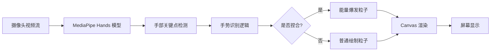

# 🎨 手势识别魔法画板

<p align="center">
  <strong>基于 MediaPipe Hands 的离线手势追踪与交互式绘画应用</strong>
</p>

<p align="center">
  
  
  
  
  
</p>

---

## 📖 项目简介

**手势识别魔法画板**是一个完全离线的浏览器端手势交互应用，利用 Google MediaPipe Hands 模型实现实时手部关键点检测。用户可以通过手势在空中绘制绚丽粒子轨迹，体验"魔法绘画"的乐趣。

### ✨ 核心特性

- 🔒 **完全离线运行**：所有资源本地化，无需网络连接即可使用
- 🖐️ **实时手势追踪**：支持最多 2 只手同时检测，21 个手部关键点精准定位
- 🎨 **交互式绘画**：移动食指产生粒子轨迹，捏合手指触发能量爆发效果
- ⚡ **高性能推理**：采用 WebAssembly + SIMD 优化，确保流畅的实时检测体验
- 🌈 **动态魔法主题**：内置多种色彩主题（冰霜凤凰、暗影荆棘、雷霆之心等），可随机切换
- 👁️ **可视化骨骼**：可选显示手部骨骼连接和关键点，直观展示检测结果
- 🎥 **摄像头预览**：可选显示摄像头画面，支持镜像翻转
- 📜 **强制开源许可**：采用 GPL-3.0 许可证，确保所有衍生作品必须保持开源

---

## 🚀 快速开始

### 前置要求

- 现代浏览器（Chrome 80+、Firefox 75+、Edge 80+、Safari 14+）
- 支持 WebGL 和 WebAssembly
- 摄像头设备（用于手势输入）
- **必须通过 HTTP 服务器访问**（不能直接打开 `file://` 协议）

### 安装步骤

#### 1. 克隆或下载项目

```bash
# 如果从 Git 仓库获取
git clone <repository-url>
cd magic-canvas-offline

# 或者直接下载 ZIP 并解压
```

#### 2. 安装依赖

```bash
npm install
```

这将安装 `@mediapipe/hands` 核心库到 `node_modules`，但项目实际使用的是 `mediapipe/` 目录下的本地文件。

#### 3. 启动本地服务器

选择以下任一方式启动 HTTP 服务器：

**方式一：使用 Node.js http-server**
```bash
npx http-server . -p 8080
```

**方式二：使用 Python**
```bash
# Python 3
python -m http.server 8080

# Python 2
python -m SimpleHTTPServer 8080
```

**方式三：使用 VS Code Live Server 插件**
- 安装 "Live Server" 扩展
- 右键点击 `index.html` → "Open with Live Server"

#### 4. 访问应用

在浏览器中打开：
```
http://localhost:8080
```

首次访问时，浏览器会请求摄像头权限，请点击"允许"。

---

## 🎮 使用说明

### 基本操作

| 手势动作 | 功能说明 |
|---------|---------|
| **移动食指** | 在空中绘制彩色粒子轨迹 |
| **捏合拇指+食指** | 触发能量爆发效果（粒子数量增加、速度加快） |
| **双手同时出现** | 两只手都会产生绘制效果 |

### 界面控制

- **📹 显示/隐藏摄像头**：切换摄像头预览画面的显示
- **🦴 显示/隐藏骨骼**：切换手部骨骼和关键点的可视化
- **🗑️ 清空画板**：清除所有已绘制的粒子和轨迹
- **✨ 召唤新魔法**：随机切换魔法主题（颜色方案）

### 魔法主题

内置 6 种预设主题，每种包含独特的正常状态颜色和捏合状态颜色：

1. **冰霜凤凰** ❄️ - 蓝紫色调，如极光般梦幻
2. **暗影荆棘** 🌑 - 紫红色调，神秘而危险
3. **琥珀流光** 🟠 - 橙黄色调，温暖而明亮
4. **雷霆之心** ⚡ - 蓝白色调，纯净而锐利
5. **翡翠梦境** 🌿 - 翠绿色调，生机盎然
6. **猩红炼狱** 🔥 - 红橙色调，炽热而狂野

---

## 🏗️ 技术架构

### 核心技术栈

- **MediaPipe Hands** (v0.4.1675469240)：Google 开源的手部追踪机器学习模型
- **WebAssembly (WASM)**：高性能模型推理引擎
- **SIMD 优化**：单指令多数据流加速计算
- **Canvas 2D API**：粒子渲染和视觉效果
- **Vanilla JavaScript**：无框架依赖，轻量级实现

### 项目结构

```
magic-canvas-offline/
├── mediapipe/                    # MediaPipe 核心运行时文件
│   ├── hands.js                  # 主接口库（~2MB）
│   ├── hands_solution_wasm_bin.js          # 标准 WASM 二进制资源
│   ├── hands_solution_simd_wasm_bin.js     # SIMD 优化版 WASM（性能更高）
│   ├── hands_solution_packed_assets_loader.js  # 资源加载器
│   ├── index.d.ts                # TypeScript 类型定义
│   └── package.json              # MediaPipe 包信息
├── index.html                    # 主应用页面（含 UI 和业务逻辑）
├── package.json                  # 项目依赖管理
├── package-lock.json             # 依赖锁定文件
├── LICENSE                       # GPL-3.0 开源许可证
└── README.md                     # 项目文档
```

### 工作流程



### 关键算法

#### 1. 手势识别逻辑

```javascript
// 计算食指指尖(landmark 8)与拇指指尖(landmark 4)的距离
const dx = indexTip.x - thumbTip.x;
const dy = indexTip.y - thumbTip.y;
const distance = Math.sqrt(dx*dx + dy*dy);
const isPinching = distance < 0.05; // 阈值 0.05
```

#### 2. 粒子系统

- **生命周期管理**：每个粒子具有独立的透明度衰减曲线
- **物理模拟**：速度衰减（摩擦力）、随机运动方向
- **颜色动态生成**：基于 HSL 色彩空间的主题化配色

#### 3. 骨骼绘制

使用 MediaPipe 标准的 21 个关键点索引，定义 20 条连接线：
- 拇指：0→1→2→3→4
- 食指：0→5→6→7→8
- 中指：0→9→10→11→12
- 无名指：0→13→14→15→16
- 小指：0→17→18→19→20
- 手掌内部：5→9→13→17

---

## ⚙️ 配置选项

### MediaPipe 模型参数

在 `index.html` 的 `initMediaPipe()` 函数中可以调整：

```javascript
hands.setOptions({
    maxNumHands: 2,              // 最大检测手数（1-2）
    modelComplexity: 1,          // 模型复杂度（0=Lite, 1=Full, 2=Heavy）
    minDetectionConfidence: 0.6, // 最小检测置信度（0.0-1.0）
    minTrackingConfidence: 0.6   // 最小跟踪置信度（0.0-1.0）
});
```

**性能调优建议：**
- 低端设备：设置 `modelComplexity: 0`，降低置信度阈值
- 高端设备：设置 `modelComplexity: 2`，提高置信度以获得更精准结果

### 粒子系统参数

```javascript
class Particle {
    constructor(x, y, isPinching) {
        const speedMult = isPinching ? 15 : 4;  // 捏合时的速度倍数
        this.decay = Math.random() * 0.02 + 0.01; // 衰减速率
        this.size = isPinching ? 
            Math.random() * 6 + 3 :  // 捏合时粒子更大
            Math.random() * 4 + 1;   // 正常时粒子较小
    }
}
```

### 画布拖尾效果

```javascript
canvasCtx.globalAlpha = 0.15;  // 调整透明度控制拖尾长度
canvasCtx.fillStyle = '#0f172a'; // 背景色
```

---

## 🔧 开发指南

### 本地开发环境搭建

```bash
# 1. 安装 Node.js（推荐 LTS 版本）
# 下载地址：https://nodejs.org/

# 2. 安装项目依赖
npm install

# 3. 启动开发服务器（带热重载）
npx http-server . -p 8080 -c-1

# 4. 在浏览器中打开 http://localhost:8080
```

### 代码结构说明

主要逻辑集中在 `index.html` 的 `<script>` 标签内：

| 模块 | 功能描述 |
|------|---------|
| `Particle` 类 | 粒子对象，包含位置、速度、生命周期、颜色属性 |
| `drawSkeleton()` | 绘制手部骨骼和关键点 |
| `animate()` | 主渲染循环，处理粒子更新和手势交互 |
| `initMediaPipe()` | 初始化 MediaPipe Hands 模型和摄像头 |
| `randomMagic()` | 随机选择魔法主题 |

### 调试技巧

1. **查看模型加载状态**：右上角状态面板会显示"正在加载 AI 模型..." → "模型就绪，请伸出手"
2. **检查摄像头权限**：确保浏览器地址栏显示摄像头图标且为允许状态
3. **性能监控**：打开浏览器开发者工具（F12）→ Performance 标签，录制帧率
4. **控制台日志**：`console.error("摄像头错误:", err)` 会输出详细错误信息

### 常见问题排查

#### 问题 1：黑屏或无法访问摄像头

**原因**：未通过 HTTP 服务器访问，或浏览器阻止了摄像头权限

**解决方案**：
```bash
# 确保使用 localhost 而非 file:// 协议
npx http-server . -p 8080
# 访问 http://localhost:8080
```

#### 问题 2：模型加载失败

**原因**：WASM 文件路径错误或 MIME 类型配置不正确

**解决方案**：
- 确认 `mediapipe/` 目录下所有 `.js` 和 `.wasm` 文件存在
- 检查浏览器控制台是否有 404 错误
- 确保服务器正确配置 WASM MIME 类型（`.wasm` → `application/wasm`）

#### 问题 3：性能卡顿

**原因**：模型复杂度过高或设备性能不足

**解决方案**：
```javascript
// 降低模型复杂度
hands.setOptions({
    modelComplexity: 0,  // 改为 Lite 模式
    minDetectionConfidence: 0.5,  // 降低置信度要求
});
```

#### 问题 4：手势识别不准确

**原因**：光线不足、手部遮挡或距离过远

**解决方案**：
- 确保良好的照明条件
- 保持手部在摄像头视野中心
- 调整 `minTrackingConfidence` 参数

---

## 📊 性能指标

### 基准测试（参考值）

| 设备类型 | 帧率 (FPS) | 延迟 | 备注 |
|---------|-----------|------|------|
| 高端桌面 (RTX 3060+) | 50-60 | <16ms | SIMD 模式下最佳性能 |
| 中端笔记本 (MX450) | 30-45 | ~25ms | Full 模型可用 |
| 低端设备 (集成显卡) | 15-25 | ~50ms | 建议使用 Lite 模型 |
| 移动端 (iPhone 12+) | 25-35 | ~35ms | Safari 需 iOS 14+ |

### 优化建议

1. **启用 SIMD**：现代浏览器自动选择 `hands_solution_simd_wasm_bin.js`
2. **降低分辨率**：修改 `getUserMedia` 的 `width/height` 参数
3. **限制手数**：设置 `maxNumHands: 1` 减少计算量
4. **简化渲染**：关闭骨骼显示（`showSkeleton = false`）

---

## 🌍 浏览器兼容性

| 浏览器 | 最低版本 | WebAssembly | SIMD | 摄像头 API |
|-------|---------|-------------|------|-----------|
| Chrome | 80+ | ✅ | ✅ (88+) | ✅ |
| Firefox | 75+ | ✅ | ✅ (89+) | ✅ |
| Edge | 80+ | ✅ | ✅ (88+) | ✅ |
| Safari | 14+ | ✅ | ❌ | ✅ |
| Opera | 66+ | ✅ | ✅ | ✅ |

**注意**：Safari 不支持 SIMD，会自动回退到标准 WASM 版本，性能略低。

---

## 🔐 隐私与安全

### 数据处理说明

- ✅ **完全本地处理**：所有视频帧和手势数据仅在浏览器本地处理
- ✅ **无网络传输**：不上传任何数据到云端服务器
- ✅ **无持久化存储**：不保存摄像头画面或手势记录
- ✅ **开源透明**：所有代码公开可审计

### 安全要求

- **HTTPS 或 localhost**：浏览器要求摄像头访问必须在安全上下文中
- **用户授权**：每次访问都需要用户明确授予摄像头权限
- **权限撤销**：用户可随时在浏览器设置中撤销摄像头权限

---

## 📝 许可证

本项目采用 **GNU General Public License v3.0 (GPL-3.0)** - 详见 [LICENSE](LICENSE) 文件

### 🛡️ Copyleft 强制开源说明

**GPL-3.0 是一种"Copyleft"许可证，核心特点是：**

✅ **你可以：**
- 自由使用、运行本软件
- 学习和修改源代码
- 分发原始代码或修改后的版本
- 将本软件用于商业目的

⚠️ **但你必须：**
- **公开你的源代码**：如果你分发基于本软件的衍生作品（无论是修改版还是包含本软件的作品），你必须以 GPL-3.0 许可证公开完整的源代码
- **保留版权声明**：必须保留原始版权声明和许可证文本
- **相同许可证**：衍生作品必须使用相同的 GPL-3.0 许可证（或兼容许可证）
- **标注修改**：如果修改了代码，必须在文件中明确标注修改内容和日期

❌ **你不能：**
- 将本软件整合到闭源专有软件中
- 分发二进制文件而不提供源代码
- 施加额外限制来约束 GPL 赋予用户的权利
- 使用专利诉讼来限制用户使用本软件

### 🔄 "代代开源"保证

GPL-3.0 确保了真正的"代代开源"：
1. **传染性**：任何包含或修改本代码的作品都必须开源
2. **永久性**：这个要求永久有效，不能被后续作者撤销
3. **全球性**：在世界范围内具有法律效力
4. **不可绕过**：即使通过云服务、SaaS 等方式也无法规避（除非使用 AGPL）

### 完整许可证文本

```
                    GNU GENERAL PUBLIC LICENSE
                       Version 3, 29 June 2007

 Copyright (C) 2007 Free Software Foundation, Inc. <https://fsf.org/>
 Everyone is permitted to copy and distribute verbatim copies
 of this license document, but changing it is not allowed.

                            Preamble

  The GNU General Public License is a free, copyleft license for
software and other kinds of works.
...
（完整文本请查看 LICENSE 文件）
```

### 第三方组件许可与版权声明

本项目使用了以下第三方开源组件和机器学习模型，我们在此致以诚挚的感谢：

#### 1. MediaPipe Hands 手部追踪模型

**来源**：Google LLC  
**许可证**：Apache License 2.0  
**仓库**：https://github.com/google/mediapipe  
**文档**：https://google.github.io/mediapipe/solutions/hands.html

**使用的文件**：
```
mediapipe/
├── hands.js                              # MediaPipe Hands JavaScript API
├── hands_solution_wasm_bin.js            # WebAssembly 二进制加载器
├── hands_solution_wasm_bin.wasm          # WebAssembly 模型二进制文件 (5.6 MB)
├── hands_solution_simd_wasm_bin.js       # SIMD 优化版加载器
├── hands_solution_simd_wasm_bin.wasm     # SIMD 优化版模型 (5.7 MB)
├── hands_solution_packed_assets_loader.js  # 资源打包加载器
├── hands_solution_packed_assets.data     # 打包的资源数据 (4.1 MB)
├── hand_landmark_full.tflite             # 完整版主手关键点检测模型 (5.2 MB)
├── hand_landmark_lite.tflite             # 轻量版主手关键点检测模型 (2.0 MB)
├── hands.binarypb                        # 二进制协议缓冲区配置
├── index.d.ts                            # TypeScript 类型定义
└── package.json                          # MediaPipe 包元数据
```

**版权声明**：
```
Copyright 2021 The MediaPipe Authors.

Licensed under the Apache License, Version 2.0 (the "License");
you may not use this file except in compliance with the License.
You may obtain a copy of the License at

    http://www.apache.org/licenses/LICENSE-2.0

Unless required by applicable law or agreed to in writing, software
distributed under the License is distributed on an "AS IS" BASIS,
WITHOUT WARRANTIES OR CONDITIONS OF ANY KIND, either express or implied.
See the License for the specific language governing permissions and
limitations under the License.
```

**重要说明**：
- MediaPipe Hands 模型由 Google 训练并发布，采用宽松的 Apache 2.0 许可证
- 本项目的 `mediapipe/` 目录包含从官方 npm 包 `@mediapipe/hands` 提取的运行时文件
- 这些模型文件是预训练的机器学习权重，不是本项目原创
- Apache 2.0 许可证与 GPL-3.0 兼容，可以合法整合到 GPL 项目中
- 如果你单独使用 MediaPipe 模型，需要遵守 Apache 2.0 许可证条款

#### 2. WebAssembly SIMD 技术

**来源**：WebAssembly Community Group  
**许可证**：BSD 3-Clause License  
**文档**：https://webassembly.org/

**说明**：
- WebAssembly 是 W3C 标准，采用 BSD 3-Clause 许可证
- SIMD（单指令多数据流）是 WebAssembly 的性能扩展
- 这些技术与 GPL-3.0 完全兼容

#### 3. Node.js 开发依赖

**package.json 中的依赖**：
```json
{
  "dependencies": {
    "@mediapipe/hands": "^0.4.1675469240"
  }
}
```

**说明**：
- `@mediapipe/hands` 仅用于开发时获取最新的模型文件
- 实际运行时使用的是 `mediapipe/` 目录下的本地文件
- 部署时无需安装 Node.js 或 npm 依赖

### 许可证兼容性说明

✅ **GPL-3.0 与 Apache 2.0 兼容**：
- Apache 2.0 是宽松许可证，允许代码被整合到 GPL 项目中
- 整合后，整个作品受 GPL-3.0 约束
- 但 MediaPipe 原始代码仍保留 Apache 2.0 许可证

✅ **GPL-3.0 与 BSD 3-Clause 兼容**：
- BSD 许可证比 GPL 更宽松，完全兼容
- 整合后同样受 GPL-3.0 约束

⚠️ **使用本项目的注意事项**：
1. 你的衍生作品必须采用 GPL-3.0（或兼容许可证）
2. 必须保留所有原始版权声明（包括 MediaPipe 的 Apache 2.0 声明）
3. 必须提供完整的源代码（包括 MediaPipe 模型文件）
4. 不能声称你对 MediaPipe 模型拥有版权

### 致谢

我们特别感谢：
- **Google MediaPipe 团队**：开发了业界领先的手部追踪模型，并以开源方式发布
- **TensorFlow Lite 团队**：提供了高效的移动端机器学习推理引擎
- **WebAssembly 社区**：推动了浏览器端高性能计算的发展
- **Free Software Foundation**：制定和维护 GPL 许可证，保护软件自由

---

## 🤝 贡献指南

欢迎提交 Issue 和 Pull Request！

### 贡献流程

1. Fork 本仓库
2. 创建特性分支 (`git checkout -b feature/AmazingFeature`)
3. 提交更改 (`git commit -m 'Add some AmazingFeature'`)
4. 推送到分支 (`git push origin feature/AmazingFeature`)
5. 开启 Pull Request

### 贡献者协议

通过提交 Pull Request，你同意：
- 你的贡献将在 GPL-3.0 许可证下发布
- 你拥有贡献代码的版权，或有权以 GPL-3.0 许可证发布
- 你的贡献不会侵犯第三方的知识产权

### 代码规范

- 使用 ES6+ 语法
- 添加必要的注释
- 保持代码简洁可读
- 测试不同浏览器兼容性
- 遵循 GPL-3.0 许可证要求

---

## 🙏 致谢

- **Google MediaPipe 团队**：提供强大的手部追踪模型（Apache 2.0 许可证）
- **Free Software Foundation**：制定和维护 GPL 许可证，保护软件自由
- **WebAssembly 社区**：推动浏览器端高性能计算
- **所有贡献者**：感谢每一位改进项目的开发者

---

## 📧 联系方式

- 📬 问题反馈：[GitHub Issues](https://github.com/your-username/magic-canvas-offline/issues)
- 💬 讨论交流：[GitHub Discussions](https://github.com/your-username/magic-canvas-offline/discussions)

---

## 📚 延伸阅读

### 许可证相关
- [GPL-3.0 官方文档](https://www.gnu.org/licenses/gpl-3.0.html)
- [为什么选择 GPL？](https://www.gnu.org/licenses/license-list.html#GPLv3)
- [Copyleft vs Permissive 许可证对比](https://choosealicense.com/)
- [Apache License 2.0](https://www.apache.org/licenses/LICENSE-2.0)

### 技术文档
- [MediaPipe Hands 官方文档](https://google.github.io/mediapipe/solutions/hands.html)
- [MediaPipe GitHub 仓库](https://github.com/google/mediapipe)
- [WebAssembly 官方网站](https://webassembly.org/)
- [WebAssembly SIMD 提案](https://github.com/WebAssembly/simd)

### 开发资源
- [Node.js 官网](https://nodejs.org/)
- [npm 包管理器](https://www.npmjs.com/)
- [Canvas API 文档](https://developer.mozilla.org/zh-CN/docs/Web/API/Canvas_API)

---

<p align="center">
  <strong>⭐ 如果这个项目对你有帮助，请给个 Star 支持一下！</strong>
</p>

<p align="center">
  <strong>🛡️ 本作品受 GPL-3.0 许可证保护，所有衍生作品必须保持开源</strong>
</p>

<p align="center">
  Made with ❤️ by Magic Canvas Team
</p>
